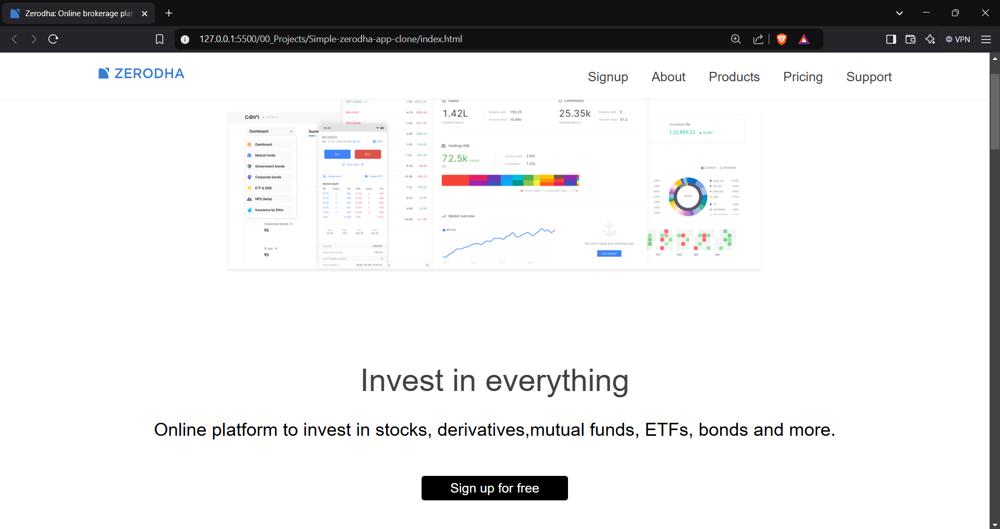

# Zerodha Landing Page Clone
This project is a clone of the Zerodha landing page, built entirely using raw HTML and CSS. It replicates the clean minimalistic design of the original Zerodha website without using any external frameworks.
## Tech Stack  
- HTML5  
- CSS3 
## Features  
- Responsive Design
- Compatible with mobile devices  
- Clean, Minimalistic UI  
- Built with Pure HTML & CSS
## Project Preview  

### Desktop View

### Mobile View

  
  

